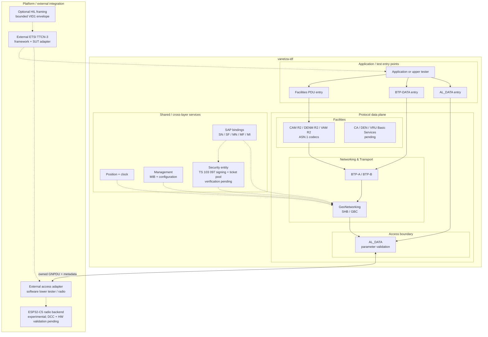

# vanetza-idf

Modular C++17 Vanetza library for ESP-IDF. Choose an access, network/transport,
or facilities-codec profile; supply your own platform and radio adapters.
The portable core targets the ESP32 family. The integrated C5 radio backend
is experimental and requires separate hardware validation.

**Start with the [ESP-IDF integration guide](docs/idf/README.md).** It covers
installation, Kconfig, ownership/event-loop rules, examples, and standalone
host/device tests. [Standards traceability](docs/idf/standards.md) links the public
interfaces to precise ETSI editions and clauses.
The [interface assessment](docs/idf/interface-assessment.md) identifies remaining
contract and capability gaps. [Test campaigns](docs/idf/test-campaigns.md) explains
how the separately installed ETSI framework and two-C5 radio tests connect.

**This is an experimental port, not a completed ETSI-conformant stack.**
See [implementation and conformance gaps](docs/idf/conformance.md) and
[validation results](docs/idf/validation.md). CAM/DENM/VAM codecs and endpoints
are distinct from complete Basic Services.

## Components and configurable boundaries

The arrangement follows the facilities, networking/transport and access layers
of the ETSI ITS station architecture, with management and security as shared
cross-layer services. It is an implementation map, inspired by
[TS 102 723-11, clauses 4–5](https://www.etsi.org/deliver/etsi_ts/102700_102799/10272311/01.01.01_60/ts_10272311v010101p.pdf)
and [EN 303 797, Annex B](https://www.etsi.org/deliver/etsi_en/303700_303799/303797/02.01.01_60/en_303797v020101p.pdf).
It does not imply that every service in those figures is implemented.

The main transmit path is deliberately kept horizontal: Facilities → BTP →
GeoNetworking → Access. Management, position/time and security are shown as
shared services because they support protocol processing rather than form another
encapsulation stage. Reception travels back up the selected layers. The access
profile omits the network and facilities layers; the network profile adds
BTP/GeoNetworking; the facilities profile also enables the individually
selectable codecs. Complete CA, DEN and VRU Basic Services are still pending.
The optional HIL envelope carries adapter payloads; it is not an ETSI protocol.

## External TTCN-3 and HIL

Install the TTCN-3 runtime and the [official ETSI ITS framework](https://forge.etsi.org/rep/ITS/TS.ITS)
separately. The library does not install or bundle them. The test application
connects that framework's suite-specific SUT adapter to these points:

| Point | API/boundary | Intended use |
|---|---|---|
| Upper tester | Named NF-SAP binding, `Stack::request`, position/time/security injection | Stimulate implemented behavior and collect actual results; full service operations remain pending |
| Software lower tester | `Access::request` and `Stack::indicate` | Inject/observe GN traffic while the protocol implementation runs on the ESP32 |
| Physical lower tester | Independent ITS-G5 capture/injection radio | Validate transmitted frames, access behavior and RF properties |

Enable `CONFIG_VANETZA_IDF_HIL` for optional bounded framing. USB/UART/BLE/IP
transports and suite-specific command decoding remain in the test application
and host SUT adapter. Preserve the ETSI codec payload and map it to the actual
service under test; never synthesize a successful acknowledgement.

The [hook-up guide](docs/idf/README.md#connect-a-separately-installed-etsi-ttcn-3-framework)
explains payload boundaries, metadata, real-time versus injected-time tests,
PICS/PIXIT, Release 2 ATS adaptation, and evidence retention. A mirrored SUT
packet is software evidence; radio conformance requires independent observation.

## Foundation and acknowledgements

vanetza-idf is an independent ESP-IDF adaptation built on
[Vanetza](https://github.com/riebl/vanetza). It is not maintained by, affiliated
with, or endorsed by the Vanetza team. Upstream authorship and license notices
remain with the original source files. See the
[upstream documentation](https://www.vanetza.org/) for the original library.

Thank you to [OpenTrafficMap](https://codeberg.org/opentrafficmap) for the
foundational work that established how to transmit ITS-G5 using the ESP32-C5
radio, shared in their
[receiver firmware with TX enabled](https://codeberg.org/opentrafficmap/its-g5-receiver-firmware_txenabled).
The C5 backend builds on that work. Its private SDK dependencies and validation
status are documented separately from the portable protocol core.

Vanetza is licensed under LGPLv3; see [LICENSE.md](LICENSE.md).
Third-party components retain their respective notices and licensing terms.
